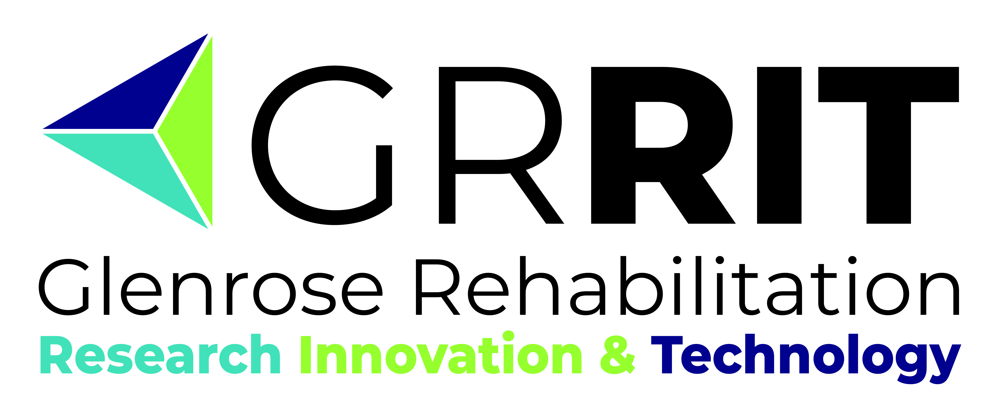

# Trigger Extenders for Joy-Con Controller
The Trigger Extenders for Joy-Con Controllerr is an aid designed to make it easier to use the triggers and bumpers on the Nintendo Joy-Con controller.

## More info at
- [Makers Making Change Project Page](https://makersmakingchange.com/project/trigger-extender-joy-con/)

## How to Obtain a Trigger Extenders for Joy-Con
### 1. Do it Yourself (DIY) or Do it Together (DIT)

This is an open-source assistive technology, so anyone is free to build it. All of the files and instructions required to build the Trigger Extenders for Joy-Con are contained within this repository. Refer to the Maker Checklist below.

### 2. Request a build of this device

If you would like to obtain a Trigger Extenders for Joy-Con, you may submit a build request through the [MMC Library Page](https://makersmakingchange.com/project/trigger-extender-joy-con/). The requestor is responsible for the cost of materials and any shipping.

### 3. How to build this device for someone else

If you have the skills and equipment to build this device, and would like to donate your time to create it for someone who needs it, visit the [MMC Maker Wanted](https://makersmakingchange.com/maker-wanted/) section.

## Getting Started

### 1. Read the Makers Checklist

The Makers Checklist provides an overview of the steps required to build the device.

### 2. Print the 3D Printable components

Print the components. Refer to the 3D Printing Guide.

All of the files and individual print files can be in the [/Build_Files/3D_Printing_Files](/Build_Files/3D_Printing_Files/) folder.

### 3. Assemble the Trigger Extenders for Joy-Con

Reference the [Assembly Guide](/Documentation/Trigger_Extender_Joycon_Assembly_Guide_V1.0.pdf) for the tools and steps required to build each portion.

## Files
### Documentation
| Document             | Version | Link |
|----------------------|---------|------|
| Design Rationale     | 1.0     | [Trigger_Extender_Joycon_Design_Rationale](/Documentation/Trigger_Extender_Joycon_Design_Rationale_V1.0.pdf)     |
| Maker Checklist      | 1.0     | [Trigger_Extender_Joycon_Maker_Checklist](/Documentation/Trigger_Extender_Joycon_Maker_Checklist_V1.0.pdf)     |
| Bill of Materials    | 1.0     | [Trigger_Extender_Joycon_Bill_of_Materials](/Documentation/Trigger_Extender_Joycon_BOM_V1.0.xlsx)     |
| 3D Printing Guide    | 1.0     | [Trigger_Extender_Joycon_3D_Printing_Guide](/Documentation/Trigger_Extender_Joycon_3D_Printing_Guide_V1.0.pdf)     |
| Assembly Guide       | 1.0     | [Trigger_Extender_Joycon_Assembly_Guide](/Documentation/Trigger_Extender_Joycon_Assembly_Guide_V1.0.pdf)     |
| User Guide           | 1.0     | [Trigger_Extender_Joycon_User_Guide](/Documentation/Trigger_Extender_Joycon_User_Guide_V1.0.pdf)    |
| Changelog            | 1.0     | [Trigger_Extender_Joycon_Changelog](/Documentation/Trigger_Extender_Joycon_Changelog_V1.0.pdf)     |

### Build Files
 - [3D Printing Files](/Build_Files/3D_Printing_Files/)

## Attribution
Designer:
 - Sacha Potvin in the [GRRIT Program](https://albertahealthservices.ca/grh/Page14207.aspx) of the Glenrose Rehabilitation Hospital

Documentation: 
 - Makers Making Change

## License
Everything needed or used to design, make, test, or prepare the Trigger Extenders for Joy-Con is licensed under the CERN 2.0 Permissive license <https://ohwr.org/project/cernohl/wikis/Documents/CERN-OHL-version-2> (CERN-OHL-P) . 

Accompanying material such as instruction manuals, videos, and other copyrightable works that are useful but not necessary to design, make, test, or prepare the Trigger Extenders for Joy-Con are published under a Creative Commons Attribution-ShareAlike 4.0 license https://creativecommons.org/licenses/by-sa/4.0/ (CC BY-SA 4.0).

---
<!-- ABOUT MMC START -->
## About Makers Making Change

Makers Making Change is a program of [Neil Squire](https://www.neilsquire.ca/), a Canadian non-profit that uses technology, knowledge, and passion to empower people with disabilities.

Makers Making Change leverages the capacity of community based Makers, Disability Professionals and Volunteers to develop and deliver affordable Open Source Assistive Technologies.

 - Website: [www.MakersMakingChange.com](https://www.makersmakingchange.com/)
 - GitHub: [makersmakingchange](https://github.com/makersmakingchange)
 - Bluesky: [@makersmakingchange.bsky.social](https://bsky.app/profile/makersmakingchange.bsky.social)
 - Instagram: [@makersmakingchange](https://www.instagram.com/makersmakingchange)
 - Facebook: [makersmakechange](https://www.facebook.com/makersmakechange)
 - LinkedIn: [Neil Squire Society](https://www.linkedin.com/company/neil-squire-society/)
 - Thingiverse: [makersmakingchange](https://www.thingiverse.com/makersmakingchange/about)
 - Printables: [MakersMakingChange](https://www.printables.com/@MakersMakingChange)

### Contact Us
For technical questions, to get involved, or to share your experience we encourage you to [visit our website](https://www.makersmakingchange.com/) or [contact us](https://www.makersmakingchange.com/s/contact).
<!-- ABOUT MMC END -->
